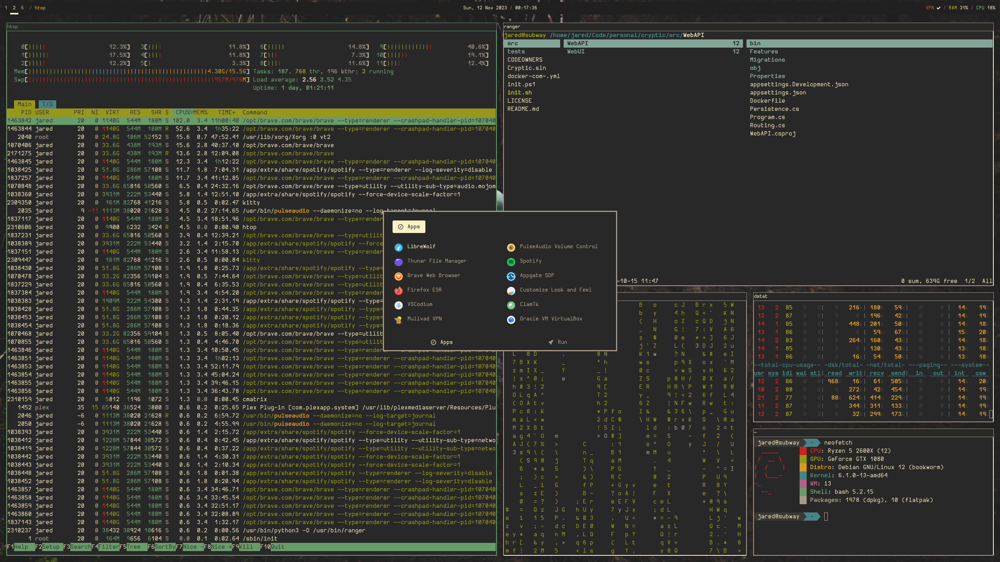
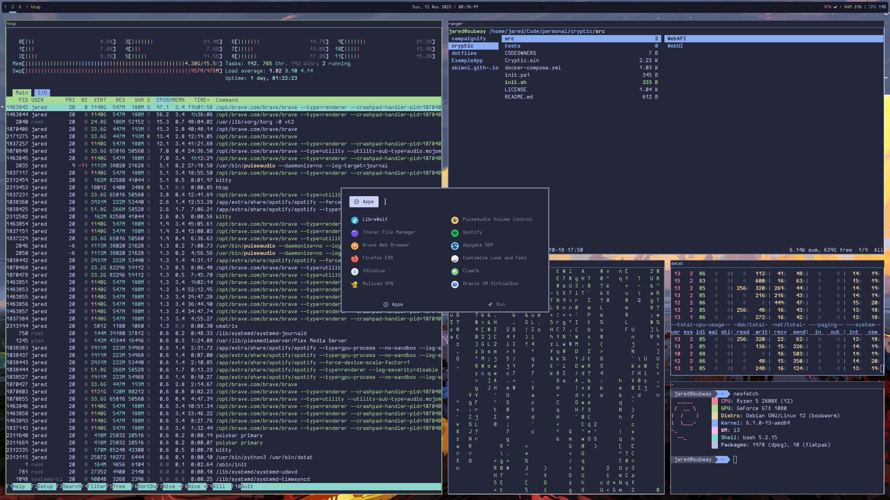
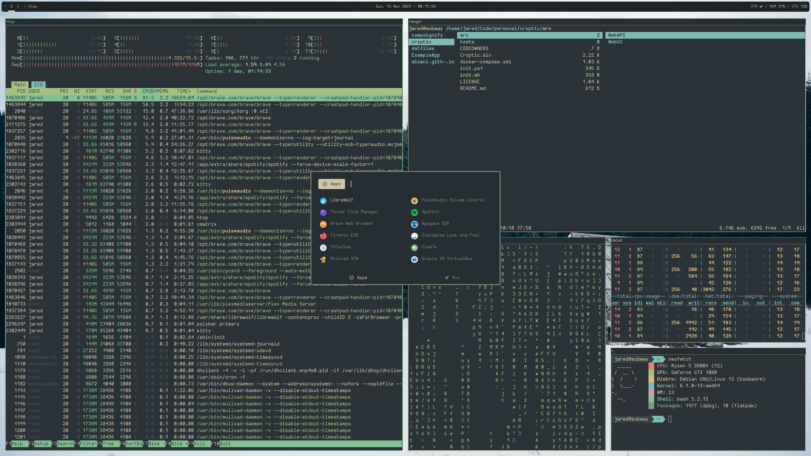
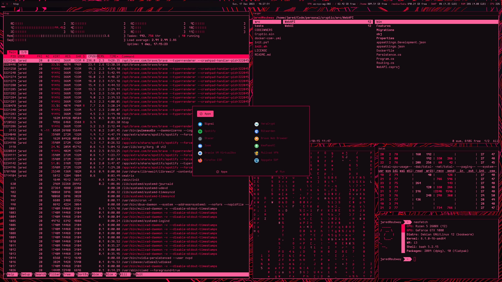

# sblmnl's dotfiles

|                    |                     |                     |
|--------------------|---------------------|---------------------|
|    |  |  |
|  |                     |                     |

Branch: [`debian-bookworm_i3`](https://github.com/sblmnl/dotfiles/tree/debian-bookworm_i3)

## Instructions

I have separated my "rices" into different git branches.

Get current dotfiles:  
`git clone https://github.com/sblmnl/dotfiles`

Get dotfiles for a specific branch:  
`git clone https://github.com/sblmnl/dotfiles -b <branch_name>`

## Software

| **Component**       | **Product**           |
|---------------------|-----------------------|
| **OS**              | Debian 12 (bookworm)  |
| **Shell**           | Bash (Oh My Bash)     |
| **Display Manager** | Ly                    |
| **DE/WM**           | i3                    |
| **Terminal**        | kitty                 |
| **Bar**             | Polybar               |
| **Launcher**        | Rofi                  |
| **Fetch**           | neofetch              |

## Hardware/Peripherals

| **Component**       | **Product**                         | **Qty** |
|---------------------|-------------------------------------|-----|
| **Case**            | NZXT H500i                          | 1   |
| **Motherboard**     | ROG STRIX B350-F Gaming             | 1   |
| **CPU**             | AMD Ryzen 5 2600X                   | 1   |
| **RAM**             | HyperX Fury DDR4 (4gb) (2133mhz)    | 4   |
| **GPU**             | ZOTAC GTX 1080 AMP Edition          | 1   |
| **PSU**             | Corsair RM750                       | 1   |
| **Boot Drive**      | Samsung 970 EVO NVME (1tb)          | 1   |
| **Monitor**         | Acer XF270HU (Cbmiiprx)             | 2   |
| **Keyboard**        | Drop CTRL (Black) (Cherry MX Brown) | 1   |
| **Mouse**           | Corsair M65 RGB ELITE               | 1   |
| **Speakers**        | Logitech Z333                       | 1   |
| **Headphones**      | Massdrop x Sennheiser HD 6XX        | 1   |
| **DAC**             | Massdrop x Grace Design SDAC        | 1   |
| **Amplifier**       | Drop O2 Amplifier                   | 1   |
| **Microphone**      | Audio Technica AT2020               | 1   |
| **Audio Interface** | Focusrite Scarlett Solo             | 1   |
